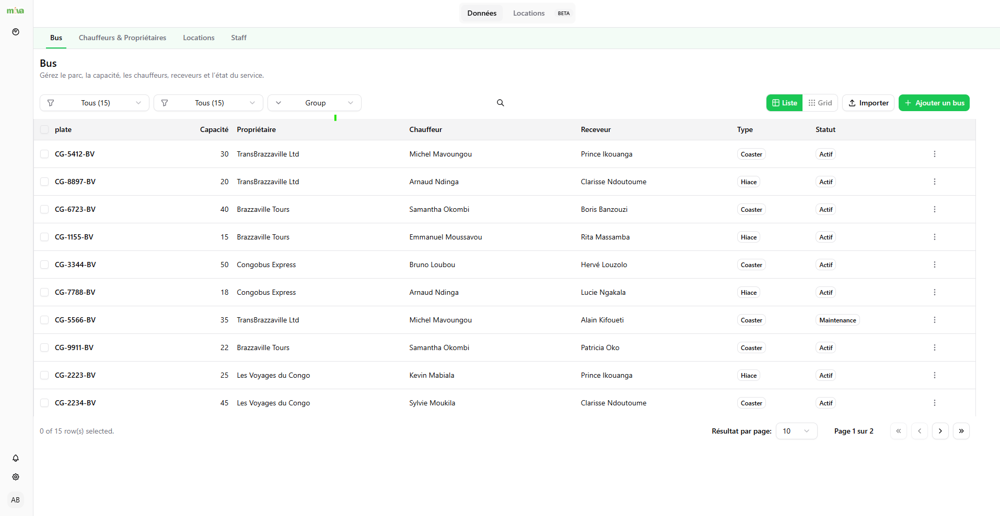

# 🚍 Mova Manager

> **Mova Manager** is a modular fleet & mobility management platform for Africa, designed for bus companies, dispatchers, drivers, and **conductors**.  
> This repository contains the **React + TypeScript + Vite** front-end powering Mova’s dashboard, tables, maps, reservations, and admin tools.

<p align="center">
  
</p>

---

## Table of Contents

- [Features](#-features)
- [Tech Stack](#-tech-stack)
- [Quick Start](#-quick-start)
- [Environment](#-environment)
- [Scripts](#-scripts)
- [Project Structure](#-project-structure)
- [Routing & Layouts](#-routing--layouts)
- [Authentication](#-authentication)
- [Data Layer](#-data-layer)
- [UI Patterns](#-ui-patterns)
- [CSV Import](#-csv-import)
- [Role: Conductor](#-role-conductor)
- [API Contracts (Bus module)](#-api-contracts-bus-module)
- [Quality: Lint, Format, Types](#-quality-lint-format-types)
- [Contributing](#-contributing)
- [Troubleshooting / FAQ](#-troubleshooting--faq)
- [Deployment](#-deployment)
- [Security](#-security)
- [Roadmap](#-roadmap)
- [License](#-license)

---

## ✨ Features

| Module | Highlights |
|-------|------------|
| **Fleet Management** | Create/edit buses, status toggles (Active/Inactive/Maintenance), capacity, models, insurance, service dates. |
| **Assignments** | Assign **owner**, **driver**, and **conductor** to a bus (role-aware UI). |
| **People Management** | Owners, drivers, conductors. |
| **Airtable-style DataTable** | Search, filters, grouping, list view, row actions, drawer details, import CSV. |
| **Auth** | JWT auth, protected routes (`RequireAuth`) and guest routes (`GuestOnly`). |
| **Maps** | Mapbox GL JS for trip visualization (opt-in per page). |
| **Notifications** | Toasts via Sonner for success/error feedback. |

---

## 🏗 Tech Stack

- **React 18** + **TypeScript**
- **Vite** (fast dev/build)
- **React Router (data router API)**
- **Tailwind CSS** + **shadcn/ui** + Radix Primitives
- **TanStack Table** (data grid)
- **Axios** with a tiny `apiService` wrapper
- **Sonner** (toasts), **Tabler/Lucide** (icons)
- **Mapbox GL JS** (maps)
- ESLint + Prettier + Strict TS

---

## ⚡ Quick Start

```bash
# 1) Clone
git clone https://github.com/<org>/mova-client.git
cd mova-client

# 2) Install deps
pnpm install      # or npm i / yarn

# 3) Configure environment
cp .env.example .env.local   # then edit values

# 4) Run
pnpm dev
# open http://localhost:5173
```

---

## 🔧 Environment

Create `.env.local` (Vite reads `VITE_*` vars):

```dotenv
VITE_API_BASE_URL=http://localhost:8000/api
VITE_MAPBOX_TOKEN=pk.xxxxxxxxxxxxxxxxxxxxxxxxxxxxx
VITE_APP_NAME=Mova
```

> If you use Mapbox anywhere, also import CSS once (e.g. in `App.tsx`):
>
> ```ts
> import "mapbox-gl/dist/mapbox-gl.css"
> ```

---

## 🧰 Scripts

```bash
pnpm dev         # Start dev server
pnpm build       # Production build to /dist
pnpm preview     # Preview built app
pnpm lint        # ESLint
pnpm format      # Prettier write
```

---

## 🗂 Project Structure

```
mova-client/
├─ public/                     # Static assets
├─ src/
│  ├─ api/                     # API clients (bus.ts, people.ts, apiService.ts)
│  ├─ app/                     # Route pages (Overview, Buses, Reservations…)
│  ├─ components/              # Reusable components (DataTable, dialogs, ui/*)
│  │  ├─ bus/                  # Bus-specific dialogs/components
│  │  └─ common/               # ImportDialog, etc.
│  ├─ context/                 # AuthContext (AuthProvider)
│  ├─ hooks/                   # useAuth, etc.
│  ├─ layouts/                 # AppLayout / AuthLayout
│  ├─ lib/                     # utils (cn, formatters)
│  ├─ pages/                   # (If using file-based segmentation)
│  ├─ router/                  # createBrowserRouter config (optional)
│  ├─ styles/                  # Tailwind config imports (if any)
│  ├─ main.tsx                 # App entry
│  └─ App.tsx                  # App shell (Providers, Router Outlet)
├─ index.html
├─ tailwind.config.ts
├─ vite.config.ts
└─ README.md
```

---

## 🔀 Routing & Layouts

We support both **standalone auth routes** and **protected app routes**.

**Example (Data Router):**

```tsx
// src/router/index.tsx
import { createBrowserRouter } from "react-router-dom"
import AppLayout from "@/layouts/AppLayout"
import AuthLayout from "@/layouts/AuthLayout"
import RequireAuth from "@/components/RequireAuth"
import GuestOnly from "@/components/GuestOnly"

import Overview from "@/app/pages/Overview"
import Buses from "@/app/pages/Buses"
import Login from "@/app/pages/Auth/Login"

export const router = createBrowserRouter([
  {
    path: "/",
    element: <AppLayout />,
    children: [
      { index: true, element: <RequireAuth><Overview /></RequireAuth> },
      { path: "buses", element: <RequireAuth><Buses /></RequireAuth> },
    ],
  },
  {
    path: "/auth",
    element: <AuthLayout />,
    children: [
      { path: "login", element: <GuestOnly><Login /></GuestOnly> },
    ],
  },
  { path: "*", element: <div>Not Found</div> },
])
```

---

## 🔐 Authentication

- `AuthContext` manages session (`/auth/me`) and token in storage.
- `RequireAuth` protects routes (renders an `<Outlet />` inside).
- `GuestOnly` blocks authenticated users from visiting `/auth/*`.

**Provider placement (safe pattern):**

```tsx
// App.tsx
import { RouterProvider } from "react-router-dom"
import { router } from "@/router"
import AuthProvider from "@/context/AuthContext"

export default function App() {
  return (
    <AuthProvider>
      <RouterProvider router={router} />
    </AuthProvider>
  )
}
```

---

## 🗃 Data Layer

- `apiService.ts` wraps Axios with base URL, token, and error typing.
- Feature clients (e.g. `src/api/bus.ts`) transform snake_case DTOs ⇄ camelCase UI models.

**Bus list (example):**
```ts
const res = await busApi.list({
  per_page: 100,
  with: ["operator", "driver", "conductor"],
  order_by: "created_at",
  order_dir: "desc",
})
setRows(res.data.rows)
```

---

## 🧩 UI Patterns

### Data Table (Airtable-style)

- Search (multi-field), filters (status/type), group-by (type/owner)
- Row actions: edit, toggle status, delete
- Drawer details (capacity, owner, driver, conductor, model, year, status)
- CSV import (see below)

### Dialogs

- `AddEditBusDialog` handles:
  - Main info (plate, type, capacity, model, year, mileage, last service date)
  - Assignments (owner, driver, conductor)
  - Optional insurance (provider, policy, valid-until)
  - Role-guarded fields (admins only)

---

## 📥 CSV Import

Accessible from **Buses** page → “Importer”.

**Supported headers:**
```
plate, label, type, model, capacity, year, status,
owner, driver, conductor,
operatorId, assignedDriverId, assignedConductorId
```

---

## 🧑‍✈️ Role: Conductor

- Appears in people and buses modules.
- Can be assigned just like a driver.
- UI hides controls for non-admins.

---

## 📡 API Contracts (Bus module)

**UI ⇄ API mapping:**
- `mileageKm` ⇄ `mileage_km`
- `lastServiceDate` ⇄ `last_service_date`
- `insuranceProvider` ⇄ `insurance_provider`
- `insurancePolicyNumber` ⇄ `insurance_policy_number`
- `insuranceValidUntil` ⇄ `insurance_valid_until`
- `operatorId` ⇄ `operator_id`
- `assignedDriverId` ⇄ `assigned_driver_id`
- `assignedConductorId` ⇄ `assigned_conductor_id`

---

## ✅ Quality: Lint, Format, Types

```bash
pnpm lint
pnpm format
```

> Commit convention: `feat(buses): add conductor column`

---

## 🤝 Contributing

1. Create a feature branch.
2. Commit cleanly.
3. Ensure build/lint pass.

---

## 🩹 Troubleshooting / FAQ

### `useNavigate()` error
Hook used outside `<Router>`. Wrap `AuthProvider` **inside** Router.

### `react-refresh/only-export-components`
Move providers/utilities to separate files.

---

## 🚀 Deployment

### Vercel
- Build Command: `pnpm build`
- Output: `dist`

### Docker
```dockerfile
FROM node:20-alpine as build
WORKDIR /app
COPY . .
RUN corepack enable && pnpm i --frozen-lockfile && pnpm build

FROM nginx:alpine
COPY --from=build /app/dist /usr/share/nginx/html
```

---

## 🔒 Security

- JWT stored in localStorage
- HTTPS required
- Role-based field locking for admins

---

## 🗺 Roadmap

- [ ] Real-time bus tracking (WebSocket)
- [ ] Offline PWA
- [ ] Multi-tenant billing
- [ ] AI dispatch assistant (Kwame)

---

## 📄 License

**© 2025 Koverae Technologies.**  
All rights reserved. Redistribution or commercial reuse is prohibited without authorization.

> _“Mova, moving Africa smarter.”_ 🌍
